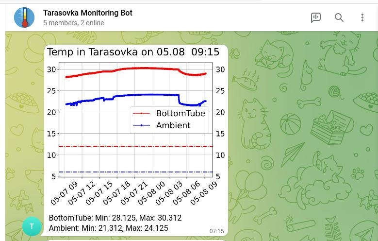
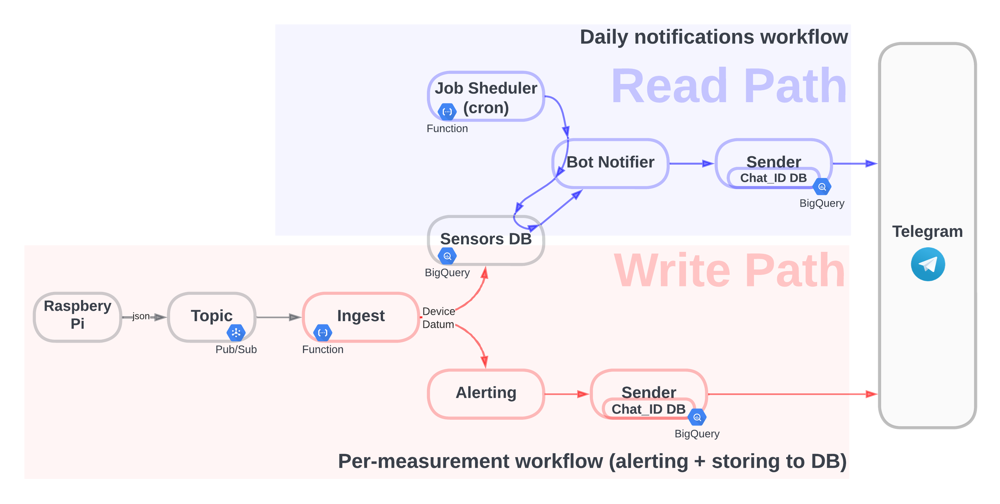

title: Intro

# **Intro**

In this tutorial we are going to create a **Temperature Monitoring and Alerting system**
that will:

* collect data from multiple temperature sensors of remote IoT devices {>>RaspberryPi<<}
* store the data in a DB {>>Google Cloud BigQuery<<}
* and notify users via a messenger {>>Telegram<<}

The final result:

--------------------------------------------------------------------------------------------------------

## **Architecture & Design principles**

As you can see on the diagram below, there are two main data processing paths:

* **write path** {>>what happens when there is new data from a sensor<<}: we store data and check
  if we need to send an alert
* **read path** {>>what happens on cron<<}: we read data for the last 24 hours, create a plot and notify
  users in a group chat via Telegram.

Code-wise, we will focus on these main areas:

* **fault-tolerance**: for example:
    * all operations will be implemented *idempotently* and *with retries*.
    * all errors will be propagated end-to-end (an error occured on RaspberryPi will be delivered
      via Telegram).
* **extensibility**: for example:
    * the `Ingest` module above will notify all subscribers via a uniform interface;
    * `BotNotifier` and `Alerting` are parameterised with a generic `Sender` interface
      that can have many implementations (*one of them*, being Telegram).
* **unit-tests**: running a wide gamut from simple unit-tests to unit-test with mocks & patches,
  as well as semi-manual integration tests.
    * For example, we will check that `Alerting` calls `send()` function of the `Sender` interface
      if temperature drops below a threshold.

Below is a brief description of each of the components form the diagram above.

--------------------------------------------------------------------------------------------------------

## **Components**

### **Raspberry Pi**

We use RaspberryPi with two attached temperature sensors.

It has a [service (daemon)](https://github.com/juleek/raspberrypi/blob/master/thermo.service) that
continuously collects measurements from the sensors and sends them via an HTTP request to a google
function, which publishes them to a Pub/Sub topic.

Setup of RaspberryPi is desribed [here](02.RaspberryPiSetup.md).

### **Topic**

Google Pub/Sub topic serves as a buffer/queue between producer (RaspberryPi) and consumer (Google
Cloud Function, `Ingest` on the diagram above). The latter is triggered on each message in the topic.

We [create and configure the topic programmatically](https://github.com/juleek/raspberrypi/blob/master/google_functions_v2/topic.py).

### **Ingest**

This is the main entry point for all incoming data from IoT device.

[`Ingest`]() [canonicalises](https://en.wikipedia.org/wiki/Canonicalization) incoming json into our
"standard" python [`dataclass DeviceDatum`](https://github.com/juleek/raspberrypi/blob/master/google_functions_v2/devicedatum.py)
that is used throughout the project, and which is one of the main data-types.

[`Ingest`]() is parameterised with a list of abstract [consumer interfaces]() (in our case, there are two consumers:
[`sensor_db`]() and [`bot_alerting`]()) and then notifies each of them with [`DeviceDatum`]() message.

### **Alerting**

[`Alerting`](https://github.com/juleek/raspberrypi/blob/master/google_functions_v2/bot_alerting.py) is
parameterised with the [`Sender`]() interface, [`Alerting`]() implements the [`Consumer`]()
interface and receives [`DeviceDatum`]() from [`Ingest`](). It then checks if temperature is lower than
a threshold.

If the temperature is lower, it uses [`Sender`]() to notify users.

### **Sender**

[Sender](https://github.com/juleek/raspberrypi/blob/master/google_functions_v2/sender.py) is an abstract
interface that allows the code to notify users in a messanger-agnostic way.

We will have just one implementation of the interface ---
[Telegram](https://github.com/juleek/raspberrypi/blob/master/google_functions_v2/telegram_sender.py).

### **SensorsDB**

[`sensor_db`]() implements [consumer interface](), receives [`DeviceDatum`]() from [`Ingest`]() and uses
[sensors_db_bg](https://github.com/juleek/raspberrypi/blob/master/google_functions_v2/sensors_db_bg.py) to
store data in BigQuery.

### **Job Scheduler** {>>cron<<}

We register [`on_cron`]() function in Cloud Cron service. The function uses [`bot_notifier`]() for daily notifications.

How to setup Google Cloud Cron [see here](Setup GoogleCloud/JobScheduler.md).

### **Bot Notifier**

[bot_notifier](https://github.com/juleek/raspberrypi/blob/master/google_functions_v2/bot_notifier.py) is
parameterised with a [`Sender`](), then, using [`sensors_db_bq`]() it retrieves data from the database for
the last 24 hours and creates a plot with a message. It then uses [`Sender`]() (which, in our case, is
[`telegram_sender`]()) to send message to a group chat.

### **Telegram**

How to set up Telegram you can find [here](Setup Telegram/Telegram.md).

### **Virtual machine**

In order to be able to ssh to RaspberryPi, we need an intermediate VM with a static public IP address
(we will use it to setup a reverse ssh tunnel).

How to provision a virtual machine in Google Cloud you can find [here](Provision VM/01.CreateVM.md).
